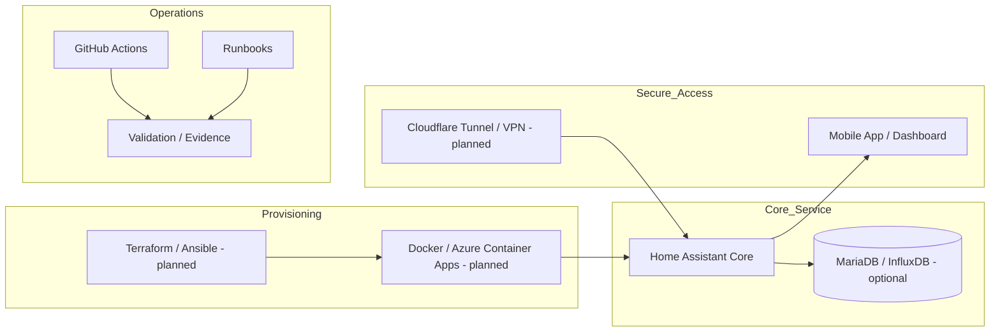

[](https://github.com/JonSil89/Home-Assistant-as-a-Service-HAaaS-/actions/workflows/status.yml)
[](https://github.com/JonSil89/Home-Assistant-as-a-Service-HAaaS-/blob/main/LICENSE)

# Home Assistant as a Service - HAaaS

Architecture, documentation and local-runtime proof-of-concept for a managed Home Assistant service model.

This repository explores how Home Assistant environments could be deployed, documented and operated with repeatable infrastructure, lifecycle management and lightweight governance practices.

> Current status: documentation, validation and runnable local Docker baseline. This is not a production-ready HAaaS platform.

## Current status

| Area | Status | Notes |
| --- | --- | --- |
| Service concept | Working documentation baseline | Managed Home Assistant / IoT operations model |
| Architecture docs | Working baseline | Azure deployment, lifecycle model, database notes, LLM/RAG roadmap |
| CI validation | Lightweight POC | GitHub Actions runs repository validation script |
| Local runtime baseline | Included | Docker Compose starts a local Home Assistant instance |
| IaC modules | Planned | Terraform/Ansible modules are not yet implemented |
| Security/compliance | Documentation baseline | GDPR/ISO/NIST are target frameworks, not certified implementation |
| Commercial model | Concept only | Pricing and service packaging are exploratory |

## Scope

This repo is meant to demonstrate operational thinking around:

- managed Home Assistant lifecycle operations
- documentation-first service design
- Infrastructure as Code planning
- deployment and rollback thinking
- Azure-oriented hosting concepts
- governance and evidence discipline
- IoT / smart building service packaging
- runnable local Home Assistant baseline for experimentation

It is intentionally scoped as a proof-of-concept and portfolio reference. It should not be interpreted as a deployable managed service without further implementation, security hardening and customer-specific architecture review.

## Repository structure

| Path | Purpose |
| --- | --- |
| `docker-compose.yml` | Runnable local Home Assistant baseline |
| `config/` | Local Home Assistant config mount placeholder |
| `docs/` | Architecture, lifecycle, deployment, data model and roadmap documentation |
| `docs/evidence/` | Validation evidence examples |
| `docs/runbooks/` | Operational runbooks and local validation guidance |
| `scripts/validate-repo.sh` | Lightweight repository validation script |
| `.github/workflows/status.yml` | CI workflow for validation |
| `.env.example` | Public-safe example environment variables |

## High-level architecture idea



## Runnable local baseline

Start a local Home Assistant instance:

```bash
docker compose up -d
```

Open:

```text
http://localhost:8123
```

The compose file binds Home Assistant to localhost only:

```text
127.0.0.1:8123:8123
```

This is intentional for local development and reduces accidental exposure outside the local machine.

See:

```text
docs/runbooks/DOCKER_LOCAL_BASELINE.md
```

## MVP path

| Step | Target | Evidence expected |
| --- | --- | --- |
| 1 | Documentation baseline | README, architecture docs, lifecycle docs |
| 2 | Local validation | `scripts/validate-repo.sh` passes and writes evidence report |
| 3 | Docker baseline | Home Assistant Docker Compose stack starts locally |
| 4 | IaC baseline | Terraform/Ansible skeleton validates without secrets |
| 5 | Operational runbooks | Backup, restore, update and rollback documented |
| 6 | Pilot readiness | Security boundaries, data model and support model reviewed |

## Local validation

Run:

```bash
bash scripts/validate-repo.sh
cat docs/evidence/VALIDATION_REPORT.md
```

The validation script checks that the repository has the required documentation baseline, public-safe environment example, CI workflow, Docker Compose baseline and core architecture files. It is intentionally lightweight and does not claim production readiness.

## Security and compliance framing

This repository may reference GDPR, ISO 27001 and NIST as design influences. These references mean documentation targets and architectural intent, not certification or full compliance.

A production HAaaS environment would still require at least:

- threat modeling
- secret management design
- access-control model
- backup and restore testing
- logging and monitoring design
- customer data classification
- vulnerability management
- legal and contractual review

## Commercial concept

The commercial HAaaS idea is exploratory: a managed Home Assistant service could package deployment, maintenance, updates, monitoring and support for homes, SMEs or property environments.

The pricing and go-to-market ideas in this repository are concept material, not active product commitments.

## Author

**Jonne Silvennoinen**  
IT specialist / technical documentation / DevSecOps-governance growth profile

Focus areas: Microsoft hybrid IT, documentation, operational security, CI/CD evidence, infrastructure governance, IoT and managed service concepts.

## License

Open-source proof-of-concept material. Commercial use, managed service packaging and customer deployments require separate review and agreement.
