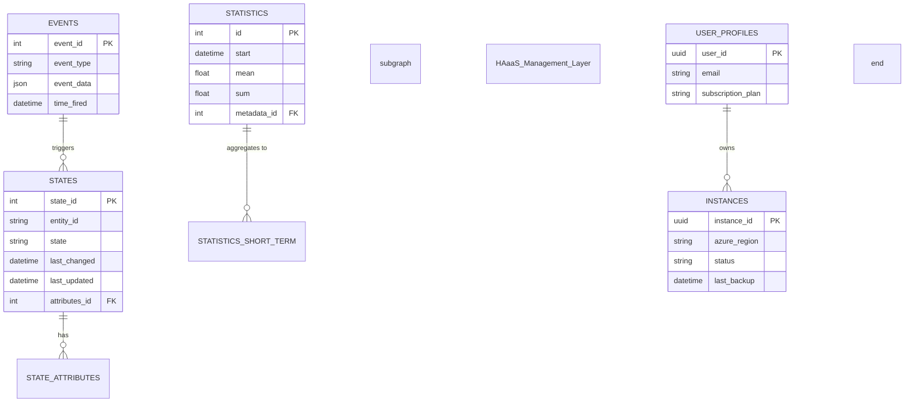

```mermaid

erDiagram
    STATES ||--o{ STATE_ATTRIBUTES : "has"
    STATES {
        int state_id PK
        string entity_id
        string state
        datetime last_changed
        datetime last_updated
        int attributes_id FK
    }
    
    EVENTS ||--o{ STATES : "triggers"
    EVENTS {
        int event_id PK
        string event_type
        json event_data
        datetime time_fired
    }

    STATISTICS ||--o{ STATISTICS_SHORT_TERM : "aggregates to"
    STATISTICS {
        int id PK
        datetime start
        float mean
        float sum
        int metadata_id FK
    }

    subgraph HAaaS_Management_Layer
        USER_PROFILES ||--o{ INSTANCES : "owns"
        USER_PROFILES {
            uuid user_id PK
            string email
            string subscription_plan
        }
        INSTANCES {
            uuid instance_id PK
            string azure_region
            string status
            datetime last_backup
        }
    end
```

