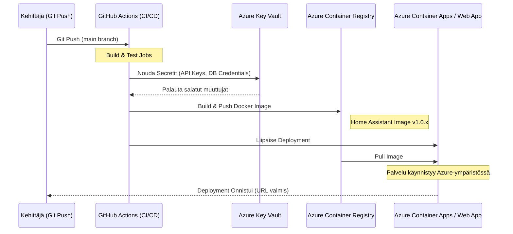

```mermaid

sequenceDiagram
    participant Dev as Kehittäjä (Git Push)
    participant GH as GitHub Actions (CI/CD)
    participant KV as Azure Key Vault
    participant ACR as Azure Container Registry
    participant ACA as Azure Container Apps / Web App

    Dev->>GH: Git Push (main branch)
    Note over GH: Build & Test Jobs
    GH->>KV: Nouda Secretit (API Keys, DB Credentials)
    KV-->>GH: Palauta salatut muuttujat
    
    GH->>ACR: Build & Push Docker Image
    Note right of ACR: Home Assistant Image v1.0.x
    
    GH->>ACA: Liipaise Deployment
    ACR->>ACA: Pull Image
    Note over ACA: Palvelu käynnistyy Azure-ympäristössä
    
    ACA-->>Dev: Deployment Onnistui (URL valmis)

```
